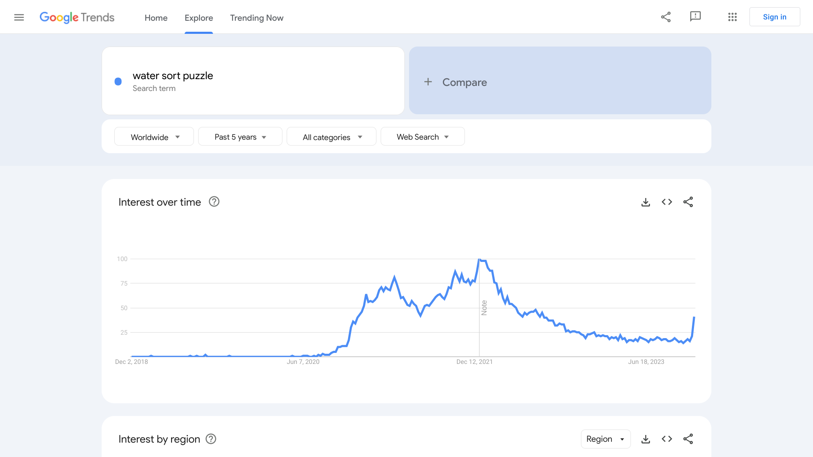

# Links about Water/Balls Sort puzzle

Online free version of the game: https://www.coolmathgames.com/0-lipuzz-water-sort

Takehiro Ito et al., Sorting Balls and Water: Equivalence and Computational Complexity, 2022. https://arxiv.org/abs/2202.09495 

Designing algorithm to solve Ball Sort Puzzle,  Last Updated : 24 Mar, 2023, by Harsh Parikh

https://www.geeksforgeeks.org/designing-algorithm-to-solve-ball-sort-puzzle/

Google trends: https://trends.google.com/trends/explore?date=today%205-y&q=water%20sort%20puzzle&hl=fr 

